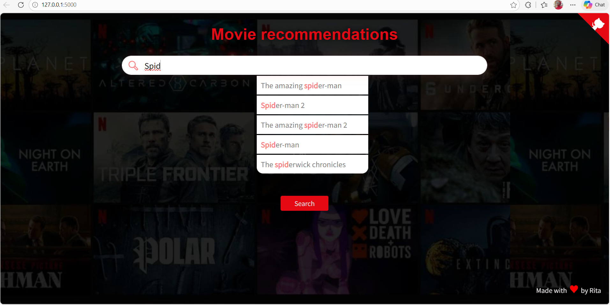
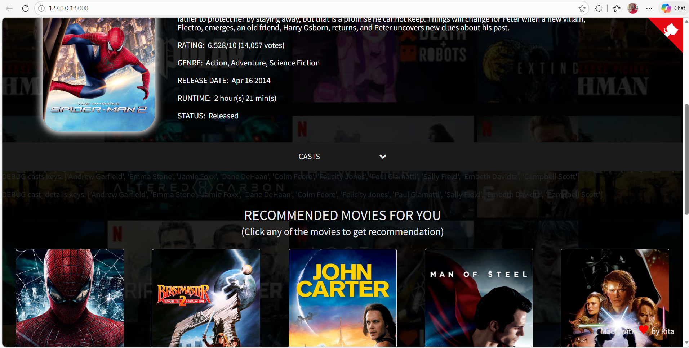
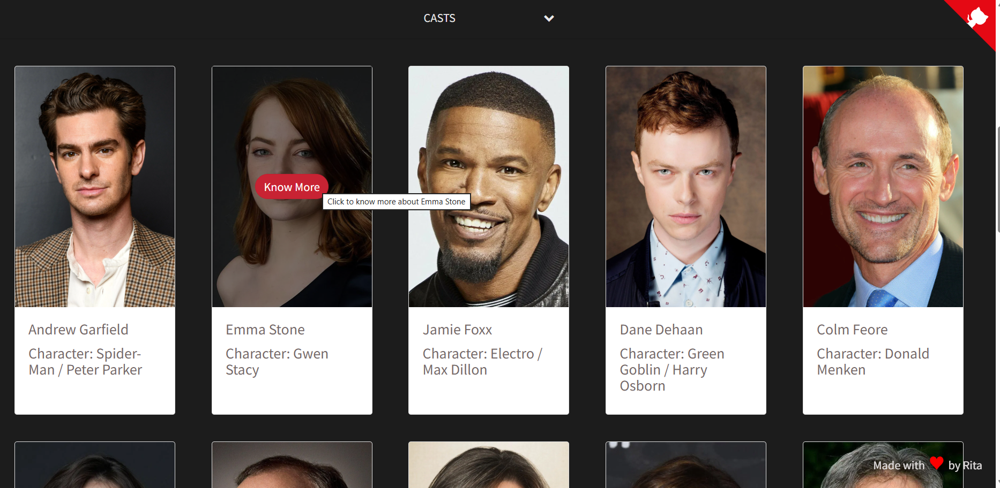

# 🎥 movie-recommendation

 


A simple and interactive movie recommendation system that suggests similar movies based on your search. Includes cast details, posters, and ratings. Built with Python and Flask.  
A movie recommendation system built with machine learning and Flask, featuring an interactive web interface deployed in the cloud where users can discover personalized movie recommendations.
- Powered by **content-based filtering** (TF-IDF + cosine similarity)  

## Screenshots




## Features ✨

🎬 Movie Recommendations - Search for a movie and get similar movie suggestions  
👥 Cast Information - View detailed cast info in collapsible sections  
💻 Web Interface - Interactive and responsive Flask-based interface    
⚡ Prepared data usage - Fetch recommendations from the pre-processed dataset  
📊 Ratings Overview - See movie ratings, vote count, release date, runtime, and status

🔒 API Key Management - Store your TMDB API key safely in a `.env` file

## 🏗️ Architecture
Recommendation System Pipeline:

🎬 Movie Dataset → Collect movie data, posters, genres, cast info  
📝 Data Cleaning → Preprocess titles, cast, genres, and overview text  
✂️ Feature Engineering → Combine fields for similarity computation  
🔢 Vectorization → Convert movie features into numerical vectors using CountVectorizer  
📊 Similarity Matrix → Compute cosine similarity between movies  
🔍 Recommendation Engine → Suggest top 10 similar movies for a given search  
👥 Cast & Details → Collapsible sections to show cast, roles, and profiles  
🌐 Web Interface → Flask app displays movies, ratings, and recommendations interactively  


## Dataset
The dataset used in this project is publicly available and has been preprocessed for recommendation purposes.
<pre> Final preprocessed dataset: main_data.csv </pre>

## 🛠️ Technology Stack
- **Backend:** Python, Flask, Pandas, NumPy, Scikit-learn  
- **Recommendation Engine:** Content-based filtering using CountVectorizer, Cosine Similarity  
- **Frontend:** HTML, CSS, Bootstrap, JS  
- **Machine Learning:** Sentiment Analysis for reviews (soon-to-be added feature)  
- **Data Storage:** CSV files, Pickle for models (.pkl)
  
## 📂 Project Structure
<pre> ```
Netflix-Movie-Recommender/
├── main.py                   # Flask application entry point
├── main_data.csv             # Dataset with movie info
├── nlp_model.pkl             # Sentiment analysis model for reviews
├── tranform.pkl              # Vectorizer for text features
├── requirements.txt          # Python dependencies
├── Procfile.txt              # Deployment instructions for Render
├── static/                   # Static files (JS, CSS, images, loader)
│   ├── autocomplete.js
│   ├── recommend.js
│   ├── style.css
│   ├── loader.gif
│   └── image.jpg
├── templates/                # HTML templates
│   ├── home.html
│   └── recommend.html
├── data/                     # Optional additional datasets
│   ├── data1.csv
│   ├── final_data.csv
│   └── new_data.csv
└── .env                      # Environment variables (API key) 
  ``` </pre>
  
## Requirements
- Python 3.9+
- Flask
- pandas
- scikit-learn
- BeautifulSoup4
- requests

Install dependencies with:
<pre> pip install -r requirements.txt </pre>

## Setup

### 1. Clone the repository
<pre> git clone https://github.com/yourusername>/movie-recommendation.git
cd movie-recommendation </pre>
  
### 2. Create a .env file in the project root and add your API key(s) in the .env file:
You need a TMDB API key to run the app
Get your API key here: [TMDB API KEY](https://www.themoviedb.org/settings/api)
After getting your api key, add it to the .env file like this:
<pre> TMDB_API_KEY="your_api_key_here" </pre>

The API key is gotten from TMDB movies used to fetch movie posters, cast info, and additional metadata.

### 3. Confirm. env is already in .gitignore.
To enable a secure API key

## Running the app

### 1. Activate your virtual environment
<pre> .venv\Scripts\activate # Windows </pre>
<pre> source .venv/bin/activate # macOS/Linux </pre>

### 2. Run the Flask app
<pre> python main.py </pre>

### 3. Open your browser and go to
http://127.0.0.1:5000


